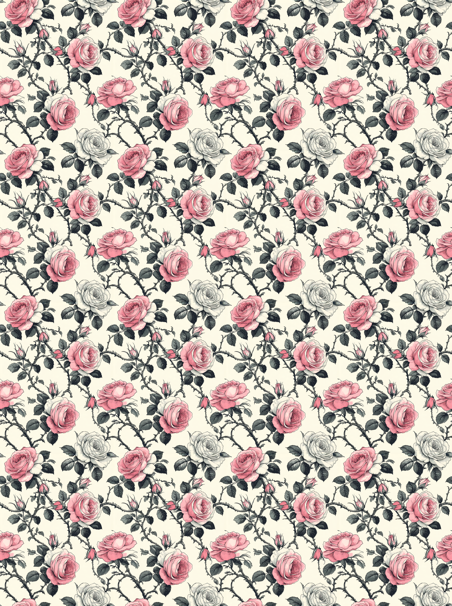
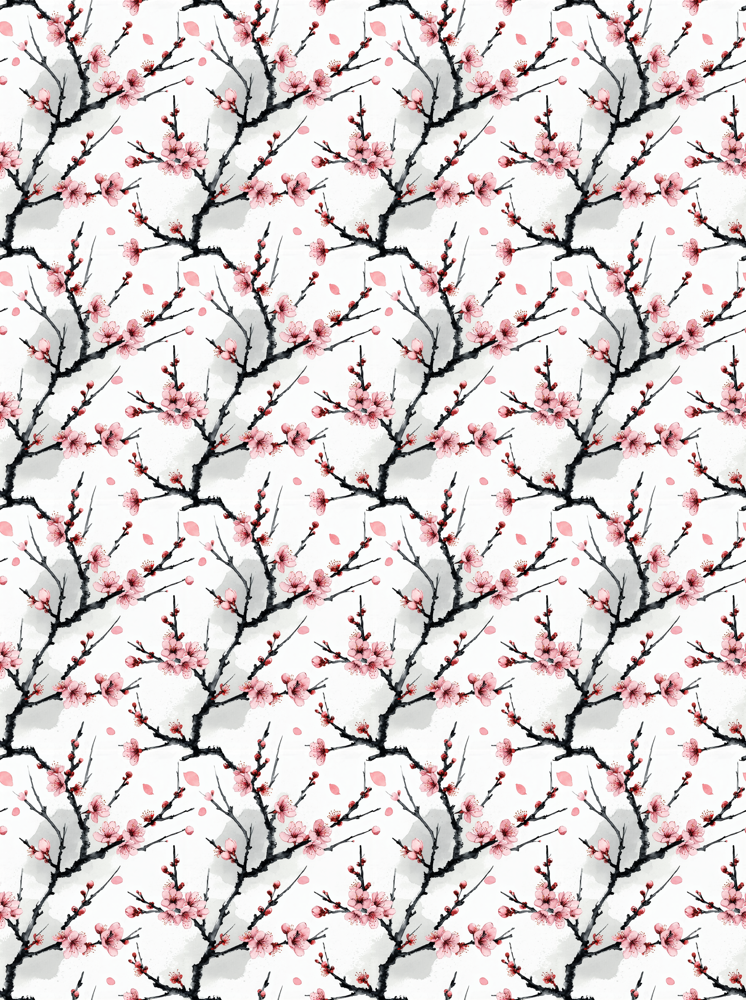
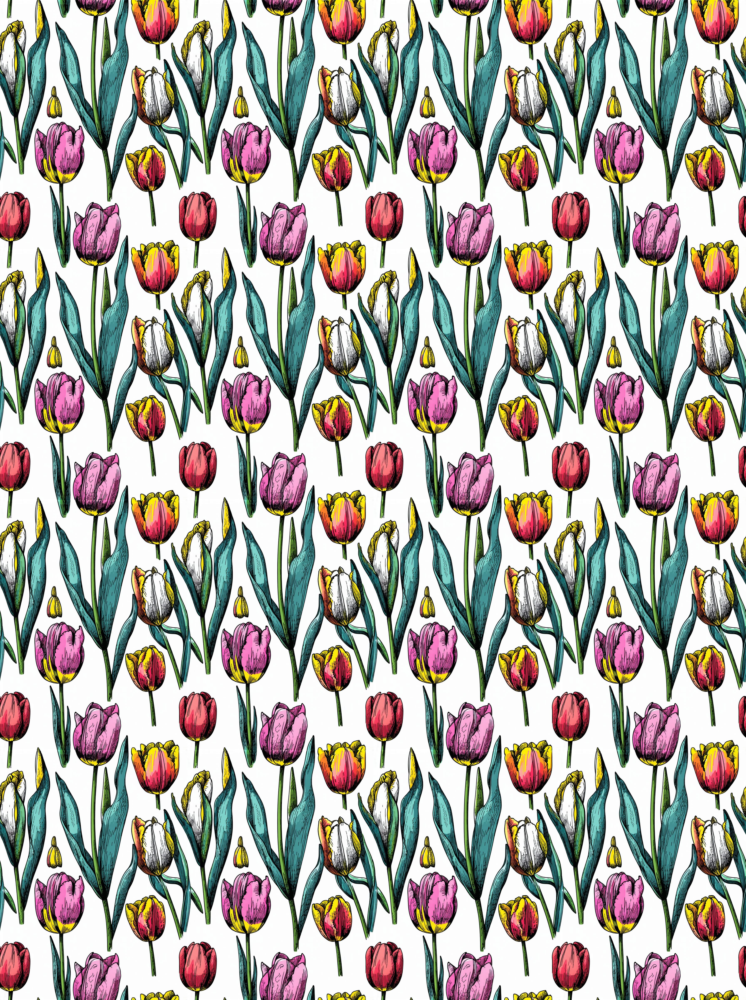

# Pattern Diffusion - Seamless  Pattern Generator

An advanced AI-powered pattern generator using Stable Diffusion 3.5 Large with specialized seamless pattern generation techniques. This project implements the "Pattern Diffusion" method for creating tileable, seamless carpet designs with various optimization options.

## 🚀 Features

- **🎯 Seamless Pattern Generation**: Advanced "Pattern Diffusion" technique for perfectly tileable carpets
- **⚡ MMGP Optimization**: Memory-efficient generation optimized for RTX 4090 and consumer GPUs
- **🏛️ Fine-tuned Models**: Support for custom LoRA fine-tuning for specific carpet styles
- **🌐 Web Interface**: Beautiful FastAPI web interface for easy pattern generation
- **📊 Memory Monitoring**: Real-time GPU and RAM usage tracking
- **🔄 Batch Processing**: Generate multiple variations with different styles and parameters

## 📋 Available Versions

1. **`modal_fastapi_finetuned_carpet_generator.py`** - Original Modal cloud deployment
2. **`local_fastapi_carpet_generator.py`** - Local deployment version
3. **`mmgp_optimized_carpet_generator.py`** - MMGP optimized for RTX 4090 (Recommended)

## 🧠 Pattern Diffusion Method

### The Seamless Generation Technique

Our seamless pattern generation uses a novel approach called "Pattern Diffusion" that ensures perfect tileability:

#### 1. **Noise Rolling** (First 80% of steps)
```python
# Shifts noise by (64, 64) pixels and wraps around edges
if step_index < int(pipe.num_timesteps * 0.8):
    callback_kwargs["latents"] = torch.roll(callback_kwargs["latents"], shifts=(64, 64), dims=(2, 3))
```

#### 2. **Circular Padding** (Last 20% of steps)
```python
# Apply circular padding to Conv2D layers for seamless edges
if step_index == int(pipe.num_timesteps * 0.8):
    make_seamless(pipe.transformer)
    make_seamless(pipe.vae)
```

#### 3. **Custom Convolution Forward Pass**
```python
def asymmetricConv2DConvForward_circular(self, input, weight, bias):
    # Applies circular padding in both X and Y dimensions
    working = F.pad(input, self.paddingX, mode="circular")
    working = F.pad(working, self.paddingY, mode="circular")
    return F.conv2d(working, weight, bias, self.stride, _pair(0), self.dilation, self.groups)
```

This method ensures that:
- ✅ Patterns tile seamlessly without visible seams
- ✅ Maintains high visual quality and detail
- ✅ Works with SD3.5 Large's advanced transformer architecture
- ✅ Compatible with LoRA fine-tuning

## 🎨 Seamless Results Demonstration

### Example: Ornate Persian Carpet Pattern

<div align="center">

| Original Pattern | Tiled 4x4 Preview |
|:----------------:|:-----------------:|
|  | ➡️  |

*Notice how the pattern tiles perfectly with no visible seams at the edges*

| Pattern 2 | Tiled 4x4 |
|:---------:|:---------:|
|  | ➡️  |

| Pattern 3 | Tiled 4x4 |
|:---------:|:---------:|
|  | ➡️  |

</div>

The arrows (➡️) show the transformation from single pattern to seamlessly tiled preview, demonstrating perfect edge continuity.

## 🛠️ Installation & Setup

### Requirements

```bash
# Install dependencies
pip install -r requirements_mmgp.txt

# Or individual packages:
pip install torch torchvision diffusers transformers accelerate peft safetensors Pillow fastapi uvicorn mmgp psutil xformers
```

## 🚀 Quick Start

### 1. Run the MMGP Optimized Version (Recommended)

```bash
python mmgp_optimized_carpet_generator.py
```

### 2. Access the Web Interface

Open your browser to: `http://localhost:8000`

### 3. Generate Your First Pattern

1. Enter a carpet design prompt (e.g., "Ornate Persian carpet with intricate floral motifs")
2. Adjust dimensions and parameters
3. Enable "Seamless Generation" for tileable patterns
4. Click "Generate Optimized Pattern"


## ⚙️ Configuration Options

### MMGP Memory Profiles

The system automatically selects the optimal MMGP profile based on your hardware:

- **HighRAM_HighVRAM** (48GB+ RAM, 24GB+ VRAM) - Fastest
- **LowRAM_HighVRAM** (32GB+ RAM, 24GB+ VRAM) - Balanced for RTX 4090
- **VeryLowRAM_LowVRAM** (24GB+ RAM, 10GB+ VRAM) - Safest

### RTX 4090 Optimizations

Automatic optimizations applied:
- ✅ TF32 enabled for ~1.5x speed boost
- ✅ Reduced precision operations
- ✅ CuDNN benchmark mode
- ✅ 95% memory fraction allocation
- ✅ Smart memory cleanup

## 🎨 Generation Parameters

### Recommended Settings

| Parameter | Recommended | Range | Description |
|-----------|-------------|-------|-------------|
| **Steps** | 28 | 10-50 | Higher = better quality, slower |
| **Guidance** | 3.5 | 1.0-10.0 | Higher = more prompt adherence |
| **Dimensions** | 1024x1024 | 512-1536 | Must be multiples of 64 |
| **Seamless** | ✅ Enabled | - | Enable for tileable patterns |

### Prompt Engineering

**Good prompts:**
- "Ornate Persian carpet with intricate floral motifs"
- "Geometric Islamic patterns in deep blue and gold"
- "Traditional Turkish kilim with abstract designs"
- "Luxurious Victorian carpet with baroque elements"

**Avoid:**
- Photographic terms ("photo", "realistic")
- Lighting references ("shadows", "3D lighting")
- People or faces
- Text or watermarks

## 🔧 Advanced Usage

### Fine-tuning with LoRA

1. Place your fine-tuned LoRA files in the `models/` directory:
   - `adapter_config.json`
   - `adapter_model.safetensors`

2. The system will automatically detect and load them

### Batch Generation

Use the scripts in `batch_generation/` for large-scale pattern creation:

```bash
python batch_generation/modal_carpet_prompt_generator_sd35_1.py
```

### API Endpoints

- `GET /` - Web interface
- `POST /generate` - Generate pattern
- `GET /health` - System status
- `GET /model-info` - Model information
- `GET /memory-stats` - Memory usage

## 📊 Performance Benchmarks

### RTX 4090 Performance (MMGP Optimized)

| Resolution | Steps | Time (s) | VRAM Usage | Quality |
|------------|-------|----------|------------|---------|
| 1024x1024 | 28 | ~30-45 | ~18GB | Excellent |
| 1280x1280 | 28 | ~45-60 | ~22GB | Excellent |
| 1536x1536 | 28 | ~60-80 | ~23GB | Maximum |

## 🙏 Acknowledgments

- **MMGP** for memory optimization techniques
- **Pattern Diffusion** method for seamless generation: https://huggingface.co/Arrexel/pattern-diffusion
